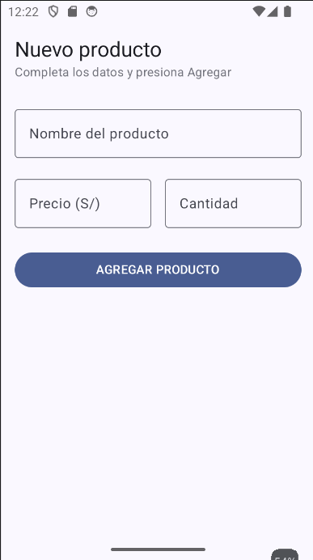
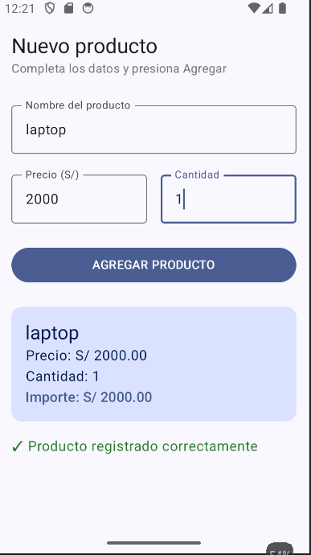

# Lab03 - Registro de Producto

**Nombre:** Magaly Rosales
**Curso:** Programación en Móviles
**Docente:** Juan José León Suiyon

## Descripción

App desarrollada con Jetpack Compose que permite registrar un producto
(nombre, precio y cantidad). Al presionar "AGREGAR PRODUCTO", se muestra
una Card con el resumen y el importe calculado (precio × cantidad).

## Capturas

### Pantalla inicial

### Producto registrado

## Reflexión: ¿qué pasa sin `remember`?

Al declarar las variables sin remember y al correr la app no se ve ningún cambio al escribir en los campos de texto  en
pantalla, pues esto sucede porque remember guarda el valor a pesar de que se reinicie la app.