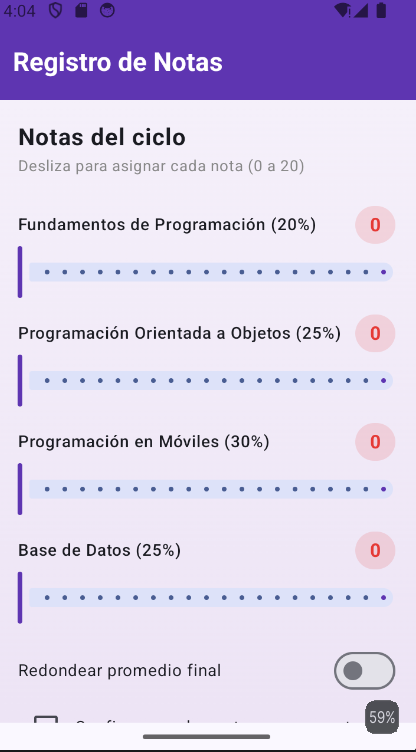
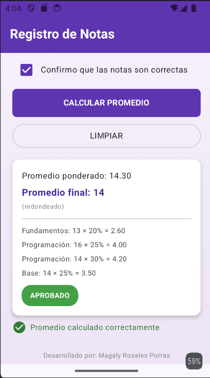

# Registro de Notas — Semana 3

App en Jetpack Compose que calcula el promedio ponderado de 4 cursos
mediante Sliders, un Switch para redondear el resultado y un Checkbox de
confirmación que habilita el botón de cálculo.

## Captura

## Desarrollado por

Magaly Rosales Porras