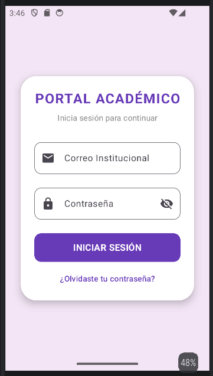
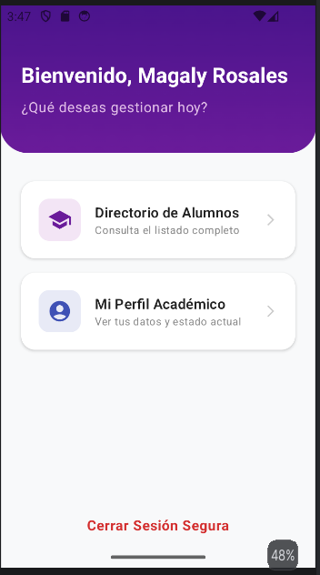
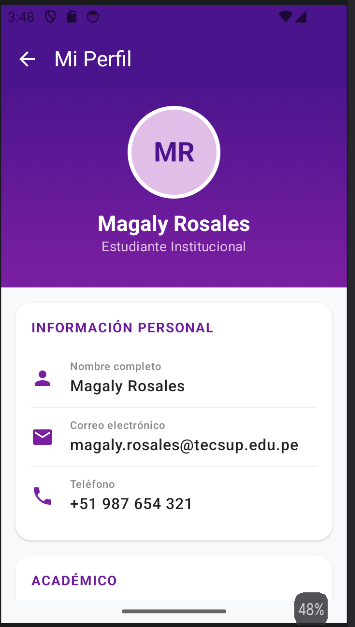
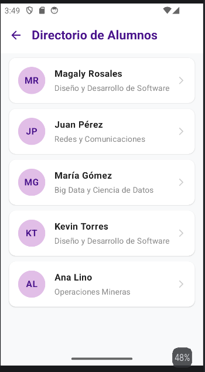
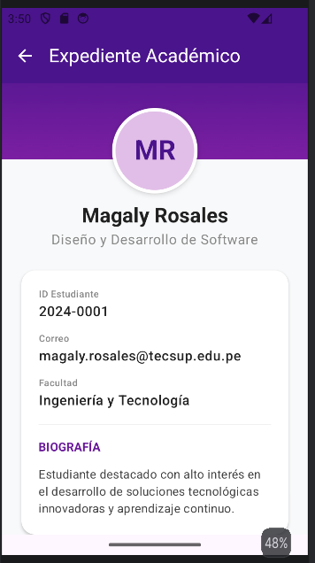

# NavLab - Portal Académico

Aplicación desarrollada en Jetpack Compose, el proyecto simula un Portal Académico con inicio de sesión, un menú principal, un directorio de alumnos y perfiles detallados, aplicando un diseño visual moderno con Material3.

## Resultados

  


 



## Prompt utilizado con Gemini

```
Actúa como diseñador UI/UX y desarrollador Senior de Android con Jetpack Compose y Material3.

Tengo un proyecto de navegación en Compose con AppNavigation.kt (NavHost) y Screen.kt (sealed class con rutas: Home, List, Detail, Profile). Quiero que agregues contenido y pantallas nuevas, expandiendo la app a un "Portal Académico":

Agrega una ruta nueva Login en Screen.kt y en el NavHost, como pantalla inicial (startDestination).
LoginScreen.kt (nueva): tarjeta central flotante con bordes muy redondeados sobre fondo pastel morado. Campos OutlinedTextField con íconos para "Correo Institucional" y "Contraseña" (con botón mostrar/ocultar). Botón morado sólido "INICIAR SESIÓN" que navega a Home. Texto "¿Olvidaste tu contraseña?".
HomeScreen.kt (reemplaza la actual): encabezado con degradado morado oscuro, texto "Bienvenido, Magaly Rosales" y subtítulo "¿Qué deseas gestionar hoy?". Debajo, tarjetas blancas con ícono: "Directorio de Alumnos" (navega a List) y "Mi Perfil Académico" (navega a Profile). Botón de texto rojo "Cerrar Sesión Segura" que vuelve a Login.
ListScreen.kt (reemplaza la actual): renómbrala conceptualmente a "Directorio de Alumnos". Crea un modelo de datos Estudiante(nombre: String, carrera: String, fotoUrl: String) con una lista de 5 estudiantes de ejemplo. TopAppBar con flecha de regreso y título "Directorio de Alumnos". Cada item: avatar circular, nombre, carrera y flecha >, navega a Detail pasando el índice como itemId: Int (mantén el argumento tipado Int en la ruta).
DetailScreen.kt (reemplaza la actual, sigue recibiendo itemId: Int): renómbrala a "Expediente Académico". Cabecera con degradado morado y avatar circular superpuesto. Usa itemId para mostrar el estudiante correspondiente de la lista: nombre, carrera. Tarjeta inferior con ID Estudiante (ej. "2024-000$itemId"), correo, facultad y biografía de ejemplo.
ProfileScreen.kt (reemplaza la actual): cabecera morada con foto circular y "Magaly Rosales". Secciones "INFORMACIÓN PERSONAL" y "ACADÉMICO" con filas e íconos: Nombre completo, Correo (magaly.rosales@tecsup.edu.pe), Teléfono, Carrera, Ciclo Actual. Botón inferior outlined rojo "Cerrar Sesión" que vuelve a Login.

Mantén el uso de NavController y el NavType.IntType para el argumento de Detail. Aplica los cambios directamente en los archivos del proyecto, creando los nuevos que hagan falta (modelo Estudiante.kt, LoginScreen.kt).
```