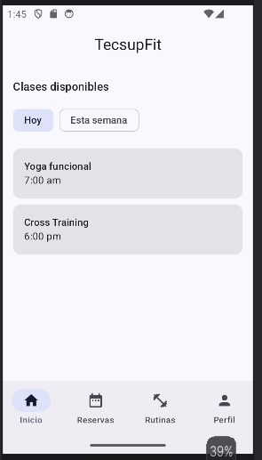
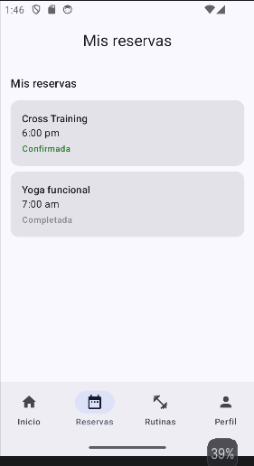
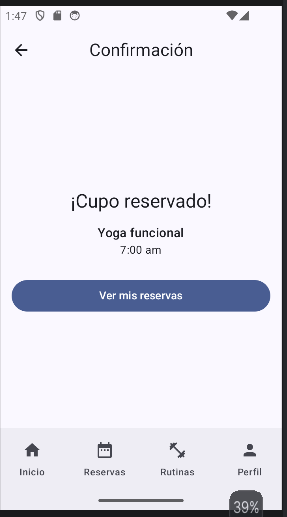
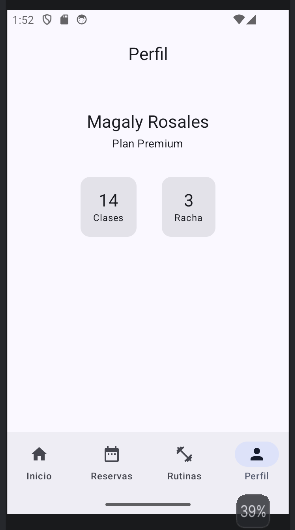

# TecsupFit - App de Gimnasio

Aplicación desarrollada en Jetpack Compose, el proyecto simula la app de un gimnasio con navegación por pestañas inferiores, listado y filtrado de clases, reserva de cupos, historial de reservas, rutinas y perfil de usuario, aplicando Material3.

## Resultados

  

 

## Requerimientos funcionales

* RF-01: El sistema debe mostrar una lista de clases disponibles y permitir filtrarlas por periodo ("Hoy" / "Esta semana").
* RF-02: El sistema debe mostrar el detalle de una clase seleccionada (horario, sala, duración, cupos).
* RF-03: El sistema debe permitir reservar un cupo y confirmar la reserva mostrando el nombre y horario de la clase.
* RF-04: El sistema debe mostrar el listado de reservas del usuario con su estado.
* RF-05: El sistema debe mostrar el perfil del usuario con su plan y estadísticas.
* RF-06: El sistema debe permitir navegar entre Inicio, Reservas, Rutinas y Perfil mediante una barra inferior.