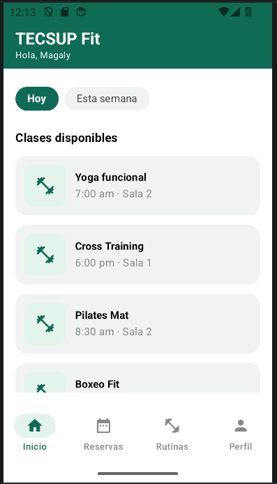
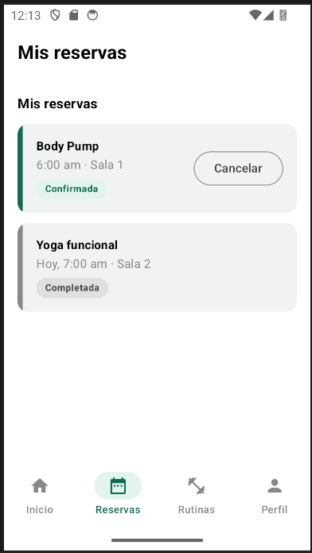
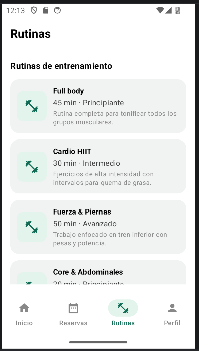
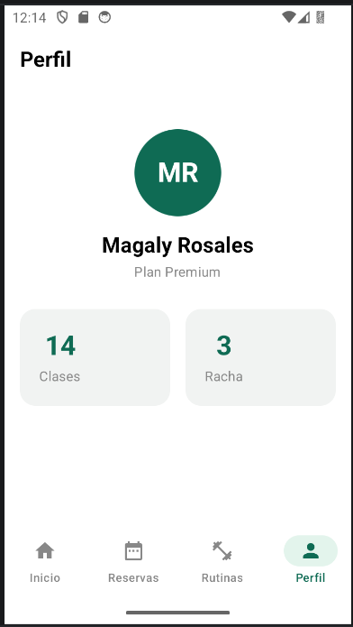

## Mejora con IA (Fase 2 — rama mejora-ia)

Se agregó reserva de cupos dinámica, cancelación de reservas con confirmación, y se aplicó el diseño visual (paleta verde) según el PDF.

### Evidencias

### Requerimientos Funcionales

* RF-01: Filtrar y listar clases disponibles.
* RF-02: Ver detalle de clase y reservar cupo.
* RF-03: Confirmar reserva con resumen.
* RF-04: Navegar entre 4 pestañas (bottomBar).
* RF-05: Ver reservas con su estado.
* RF-06: Cancelar reserva con confirmación.

### Prompt utilizado con Gemini

Soy estudiante de Programación en Móviles. Mi app Android "TECSUP Fit" (reserva de clases de gimnasio, Kotlin + Jetpack Compose + Material3, paquete com.rosales.tecsupfit) tiene las pantallas Inicio, Detalle de clase, Confirmación, Reservas, Rutinas y Perfil, con una bottomBar de 4 pestañas.

RESTRICCIONES:
- NO usar ViewModel, MVVM, Hilt ni Room.
- Todo el estado con remember / mutableStateOf / mutableStateListOf.
- Navegación con NavHost, manteniendo los nombres de archivos y funciones existentes.
- Código simple y comentado en español.
- No ejecutar comandos de git.

MEJORAS A IMPLEMENTAR:

1. Reservas dinámicas: al pulsar "Reservar cupo", la reserva debe agregarse realmente a Mis reservas (estado elevado a TecsupFitApp con mutableStateListOf), descontando 1 cupo de la clase y agregando la reserva con estado "Confirmada". No permitir reservar dos veces la misma clase ni reservar sin cupos.

2. Cancelar reserva: en Reservas, las reservas "Confirmada" deben tener un botón "Cancelar" que abra un AlertDialog ("¿Seguro que quieres cancelar tu reserva de X?"). Al confirmar, se elimina la reserva, se devuelve el cupo y se muestra un Snackbar "Reserva cancelada". Las "Completada" no se pueden cancelar.

3. Corrección de navegación: el botón "Inicio" de la bottomBar dejaba de responder después de confirmar una reserva. Corregir el uso de restoreState/launchSingleTop para que "Inicio" siempre funcione.

4. Pantalla Rutinas: agregar una lista de 5 rutinas de ejemplo (nombre, duración y nivel) en un LazyColumn.

5. Diseño visual (según Figuras 3 y 4 del PDF): aplicar una paleta verde (VerdeOscuro #0F6B54, VerdeClaro #E3F4EC, GrisTarjetas #F1F3F2) en TopAppBar, chips, tarjetas, íconos, bottomBar, avatar de Perfil y chips de estado en Reservas, sin modificar la lógica ni la navegación existentes.

Al terminar cada parte, verificar que el proyecto compile y explicar en 3-4 líneas qué archivos se modificaron.