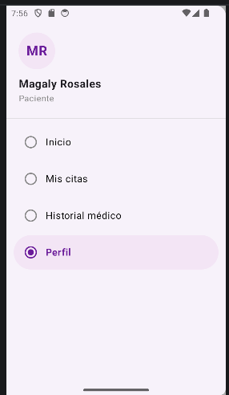
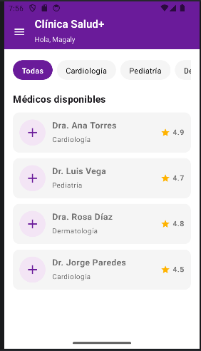
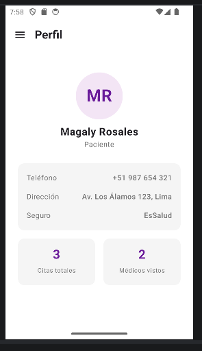
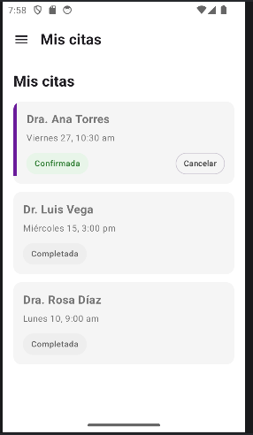
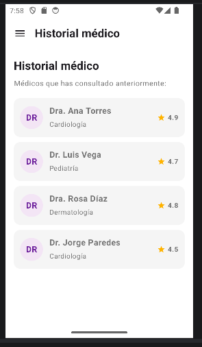

# Clínica Salud+ — App de Reserva de Citas Médicas

Aplicación desarrollada en Jetpack Compose. Esta rama incluye la mejora con IA: cancelación de citas, validaciones y diseño visual morado según la Figura 1 del PDF.

## Resultados

## Requerimientos Funcionales

* RF-01: Filtrar y listar médicos por especialidad.
* RF-02: Ver perfil del médico y agendar cita.
* RF-03: Elegir fecha y hora (selección única) antes de confirmar.
* RF-04: Confirmar la cita con resumen.
* RF-05: Navegar mediante drawer (Inicio, Mis citas, Historial médico, Perfil).
* RF-06: Ver mis citas con su estado (Confirmada / Completada).
* RF-07: Cancelar una cita con AlertDialog de confirmación.
* RF-08: Validar que no se agende la misma cita dos veces.

### Prompt utilizado con Gemini
Soy estudiante de Programación en Móviles. Mi app Android "Clínica Salud+" (reserva de citas médicas, Kotlin + Jetpack Compose + Material3, paquete com.rosales.clinicasaludplus) ya funciona con: Inicio (LazyRow de especialidades y LazyColumn de médicos), Perfil del médico, Agendar cita (selección única de fecha y hora), Confirmación, Mis citas, Historial médico y Perfil del paciente, con un ModalNavigationDrawer en ClinicaSaludApp.kt.

Lee todo el proyecto antes de modificarlo y trabaja SOBRE lo que ya existe, sin reescribirlo desde cero.

RESTRICCIONES (obligatorias):
- NO usar ViewModel, MVVM, Hilt ni Room.
- Todo el estado con remember / mutableStateOf / mutableStateListOf.
- Navegación con NavHost. Mantén los nombres de archivos y funciones existentes.
- Código simple y comentado en español, porque tengo que explicarlo en una sustentación oral.
- NO ejecutes comandos de git.

MEJORAS A IMPLEMENTAR:

1. Cancelar cita: en Mis citas, las citas "Confirmada" tienen un botón "Cancelar". Al pulsarlo se abre un AlertDialog ("¿Seguro que quieres cancelar tu cita con X?") con botones "Sí, cancelar" y "No". Al confirmar, se elimina la cita de la lista y se muestra un Snackbar "Cita cancelada" (usa el snackbarHost del Scaffold en ClinicaSaludApp). Las citas "Completada" no tienen botón Cancelar.

2. Validaciones: no permitir agendar la misma cita (mismo médico, fecha y hora) dos veces, mostrando un aviso. Agrega en la lista inicial de citas 2 ejemplos con estado "Completada". Si no hay citas, mostrar "Aún no tienes citas agendadas".

3. Diseño visual (según Figura 1 del PDF, que adjunto): aplicar una paleta morada:
    - Morado principal: #6A1B9A
    - Morado claro (fondos suaves): #F3E5F5
    - Gris tarjetas: #F5F5F5
      Definir los colores en ui/theme/Color.kt e integrarlos en el tema.
    - TopAppBar morada en Inicio con "Clínica Salud+" y debajo "Hola, [nombre]".
    - Chips de especialidad: el seleccionado en morado con texto blanco, el resto gris claro.
    - Tarjetas de médico: ícono "+" en círculo morado claro, nombre en negrita, especialidad y calificación con estrella.
    - Perfil del médico: ícono grande "+" en círculo morado claro centrado arriba, nombre, especialidad, calificación, descripción, botón "Agendar cita" morado fijo abajo.
    - Agendar cita: chips de fecha y hora, el seleccionado en morado con texto blanco; botón "Confirmar cita" morado.
    - Confirmación: círculo verde claro con ícono check, "¡Cita agendada!", nombre del médico, fecha y hora, botón "Ver mis citas".
    - Drawer: encabezado con avatar circular morado claro con iniciales, nombre del paciente y "Paciente" debajo; ítems del menú con ícono tipo radio button (círculo) a la izquierda, el seleccionado resaltado en morado con fondo morado claro.
    - Mis citas: tarjetas con nombre del médico, fecha/hora, y chip de estado (verde claro = Confirmada, gris = Completada).

No cambies la lógica ni la navegación existente, solo estilos y estructura visual donde corresponda.
