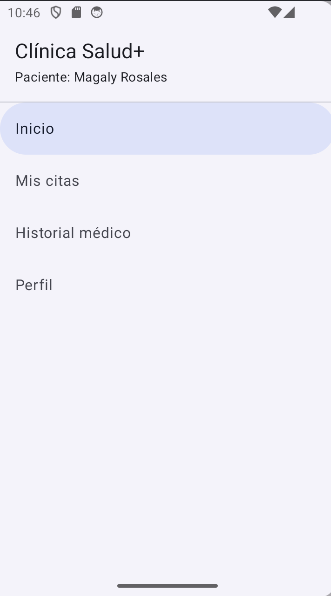
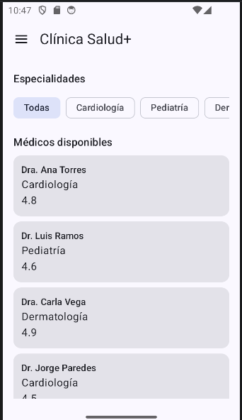
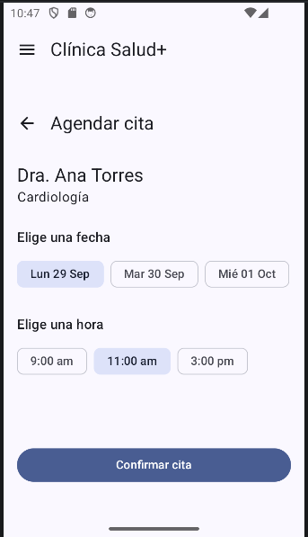
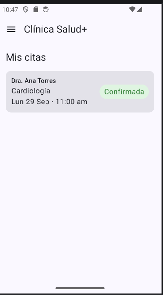
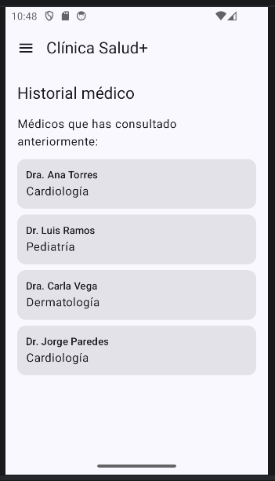
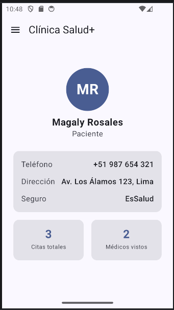

# Clínica Salud+ — App de Reserva de Citas Médicas

Aplicación desarrollada en Jetpack Compose.

## Resultados

## Requerimientos Funcionales

* RF-01: Filtrar y listar médicos por especialidad.
* RF-02: Ver perfil del médico y agendar cita.
* RF-03: Elegir fecha y hora  antes de confirmar.
* RF-04: Confirmar la cita con resumen.
* RF-05: Navegar mediante drawer (Inicio, Mis citas, Historial médico, Perfil).
* RF-06: Ver mis citas con su estado (Confirmada / Completada).