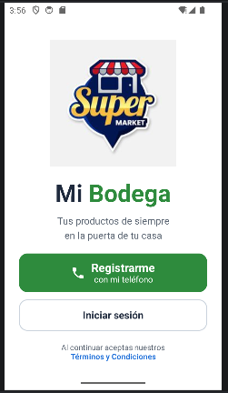
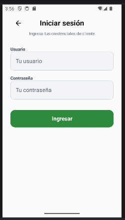
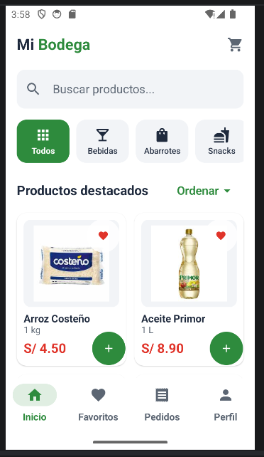
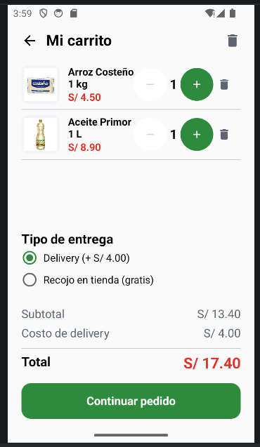
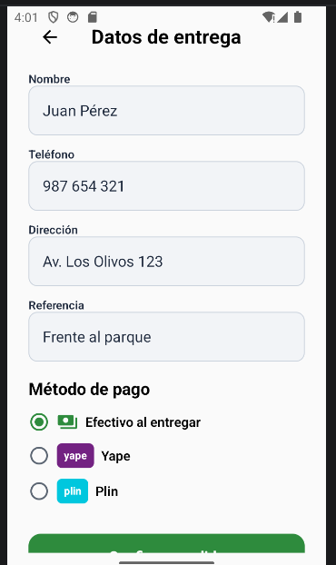
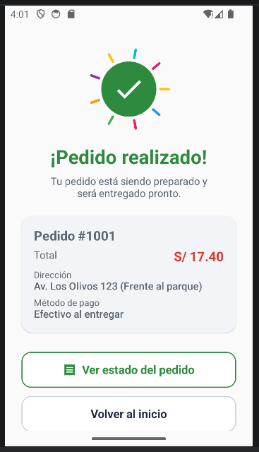
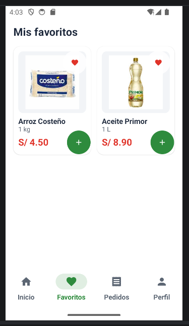

# Mi Bodega – Fase 2 (Mejora con IA)

## Cómo probarla

- Usuario: `cliente`
- Contraseña: `1234`

## Resultado

## Prompt utilizado 
Estás integrado en Android Studio y tienes acceso a mi proyecto MiBodega (Kotlin, Jetpack Compose, Material 3, Navigation Compose 2.8.0, package com.tecsup.mibodega). Modifica directamente los archivos del proyecto. Adjunto la imagen de referencia "Figura 2: App Cliente - Comprar productos y hacer pedidos" (7 pantallas). Quiero que la app quede VISUALMENTE IGUAL a esa imagen, con imágenes reales de productos, sin romper la lógica que ya funciona.

El proyecto ya tiene una primera versión del rediseño y casi no se nota la diferencia con la imagen. Revisa cada pantalla contra la Figura 2 y corrige hasta que se vea igual. Quiero cambios visibles.

ESTRUCTURA ACTUAL
- MainActivity.kt: modo oscuro con rememberSaveable y BodegaTheme(darkTheme).
- ui/cliente/ClienteApp.kt: NavHost con animaciones y estado compartido (carrito, favoritos, pedidos, tipoEntrega) con state hoisting. Rutas: bienvenida, registro, login, inicio, favoritos, pedidos, perfil, detalle/{productoId}, carrito, entrega, confirmacion.
- ui/cliente/modelo: Producto, ItemCarrito, Pedido, TipoEntrega (DELIVERY S/ 4.00, RECOJO S/ 0.00), MetodoPago, DatosFake.kt.
- ui/cliente/screens/<nombre>/<Nombre>Screen.kt: bienvenida, registro, login, inicio, detalle, carrito, entrega, confirmacion, favoritos, pedidos, perfil.
- ui/componentes: BotonPrimario, BotonSecundario, CampoTexto, ProductoCard, SelectorCantidad, BarraNavegacion (INICIO, FAVORITOS, PEDIDOS, PERFIL).
- ui/theme: Color.kt (VerdeBodega, RojoPrecio), Theme.kt, Type.kt.

IMÁGENES (YA ESTÁN en app/src/main/res/drawable, no hace falta crearlas)
arroz_costeno.jpg, aceite_primor.jpg, leche_gloria.jpg, galleta_oreo.jpg, coca_cola.jpg (fotos de los productos) e ilustracion_bodega.jpg (logo de Bienvenida). Úsalas con painterResource(R.drawable.nombre).

DATOS (igual que la figura)
- Producto: agrega @DrawableRes val imagen: Int y val presentacion: String.
- Arroz Costeño, "1 kg", S/ 4.50, Abarrotes, R.drawable.arroz_costeno
- Aceite Primor, "1 L", S/ 8.90, Abarrotes, R.drawable.aceite_primor
- Leche Gloria, "1 L", S/ 5.20, Abarrotes, R.drawable.leche_gloria
- Galleta Oreo, "126 g", S/ 3.50, Snacks, R.drawable.galleta_oreo
- Coca-Cola Original, "1.5 L", S/ 6.50, Bebidas, R.drawable.coca_cola, descripción "Bebida gaseosa sabor cola. Ideal para compartir en familia."

REGLAS OBLIGATORIAS
1. No rompas lo que funciona: login con usuario "cliente" y contraseña "1234" con mensaje de error; campos vacíos marcados en rojo (Registro y Entrega); badge del carrito; mensaje de carrito vacío; AlertDialog al eliminar un producto y al vaciar el carrito; RadioButton Delivery/Recojo que cambia el total; Mis pedidos; Favoritos con corazón; ordenar por precio; modo oscuro con Switch en Perfil; animaciones del NavHost; popUpTo al confirmar.
2. La barra inferior conserva sus 4 destinos (Inicio, Favoritos, Pedidos, Perfil), con el ítem activo en verde.
3. Mantén el state hoisting: las pantallas no guardan carrito, favoritos ni pedidos; todo llega por parámetros y lambdas desde ClienteApp.
4. Usa solo colores del tema (MaterialTheme.colorScheme.* y Color.kt) para que el modo oscuro siga funcionando. Nada de Color.White ni Color.Black fijos en fondos o textos.
5. No agregues dependencias nuevas (usa painterResource, sin Coil). Usa Material Icons.
6. Entrégame cada archivo modificado COMPLETO con su ruta, package e imports. Al final lista los archivos cambiados y qué debo probar.

PARTE A - BUSCADOR EN TIEMPO REAL (mejora obligatoria)
- En InicioScreen, el campo "Buscar productos..." filtra la lista mientras escribo y se combina con el chip de categoría y con el orden por precio. Los filtros funcionan juntos, ninguno reemplaza a otro.
- Ignora mayúsculas, tildes y espacios al inicio o al final.
- Botón "X" para limpiar, visible solo si hay texto.
- Sin resultados: estado vacío con ícono y el texto "No encontramos productos".
- Explícame en 3 líneas cómo combinaste los filtros.

PARTE B - DISEÑO IGUAL A LA FIGURA 2 (pantalla por pantalla)
1. Bienvenida: ilustración de la bodega grande arriba, título "Mi Bodega" ("Mi" oscuro, "Bodega" verde y grande), subtítulo "Tus productos de siempre en la puerta de tu casa", botón verde grande con ícono a la izquierda y dos líneas de texto ("Registrarme" / "con mi teléfono"), botón blanco con borde "Iniciar sesión", y abajo "Al continuar aceptas nuestros" + "Términos y Condiciones" en azul.
2. Crear cuenta: flecha atrás y título "Crear cuenta"; subtítulo "Completa tus datos para continuar"; avatar circular celeste con ícono de persona y una insignia azul con "+" abajo a la derecha; cuatro campos con la etiqueta arriba (Nombre completo, Teléfono, Dirección de entrega, Referencia) y bordes redondeados finos; botón verde "Crear cuenta" de ancho completo. Login usa el mismo estilo.
3. Inicio: barra superior con "Mi Bodega" (Mi oscuro, Bodega verde) a la izquierda y carrito con badge rojo a la derecha; buscador con lupa; cuatro fichas de categoría (Todos, Bebidas, Abarrotes, Snacks) con ícono arriba y texto abajo, la seleccionada con fondo verde e ícono blanco; título "Productos destacados" con el botón de orden por precio a la derecha; cuadrícula de 2 columnas de ProductoCard: foto del producto arriba (Image con painterResource, ContentScale.Fit, dentro de un recuadro redondeado claro y con el corazón de favorito en la esquina), nombre en negrita, presentación en gris, precio en rojo (RojoPrecio) en negrita y botón circular verde "+" a la derecha.
4. Detalle: flecha atrás arriba a la izquierda y corazón arriba a la derecha; foto grande del producto centrada (ocupa gran parte de la parte superior, como la botella de la figura); nombre grande en negrita, presentación en gris, precio grande en rojo y negrita, descripción en gris; selector de cantidad en recuadro redondeado con "-" gris, número y "+" verde relleno; botón verde de ancho completo con ícono de carrito y "Agregar al carrito".
5. Carrito: título "Mi carrito" a la izquierda y basurero arriba a la derecha que vacía el carrito con AlertDialog; cada fila con miniatura del producto a la izquierda (foto real), nombre con presentación (ej. "Coca-Cola 1.5 L"), precio en rojo, selector "- 1 +" debajo y basurero pequeño a la derecha; mantén los RadioButton de entrega; resumen con Subtotal, Costo de delivery, línea divisoria y Total en negrita; botón verde "Continuar pedido".
6. Datos de entrega: flecha atrás y título "Datos de entrega"; campos Nombre, Teléfono, Dirección y Referencia con etiqueta arriba y validación en rojo; sección "Método de pago" con tres RadioButton: "Efectivo al entregar" (ícono Payments, seleccionado por defecto), "Yape" (recuadro morado con ícono) y "Plin" (recuadro celeste con ícono); botón verde "Confirmar pedido". onConfirmar entrega (nombre, telefono, direccion, referencia, metodoPago); Pedido guarda esos datos; la numeración de pedidos empieza en 1001.
7. Confirmación: círculo verde grande con check blanco y rayitas de confeti de colores alrededor dibujadas con Canvas; título "¡Pedido realizado!" en verde y negrita; subtítulo "Tu pedido está siendo preparado y será entregado pronto."; tarjeta con "Pedido #NÚMERO" en negrita, "Total" en rojo, "Dirección" con la dirección y la referencia entre paréntesis y el método de pago; botón con borde verde "Ver estado del pedido" (lleva a Pedidos) y botón con borde "Volver al inicio". Respeta el popUpTo actual: al confirmar y al presionar atrás se vuelve a Inicio, no al formulario.
8. Favoritos, Pedidos y Perfil: mismo estilo (tarjetas con esquinas redondeadas, títulos en negrita, verde como color principal), con la miniatura del producto en Favoritos y Pedidos, y el método de pago de cada pedido en Mis pedidos.

Compara cada pantalla con la figura en tamaños de imagen, espaciados, bordes redondeados, tamaños de texto, colores, tamaño y posición de íconos y botones, y corrige las diferencias. Todo debe verse bien en modo claro y oscuro.

