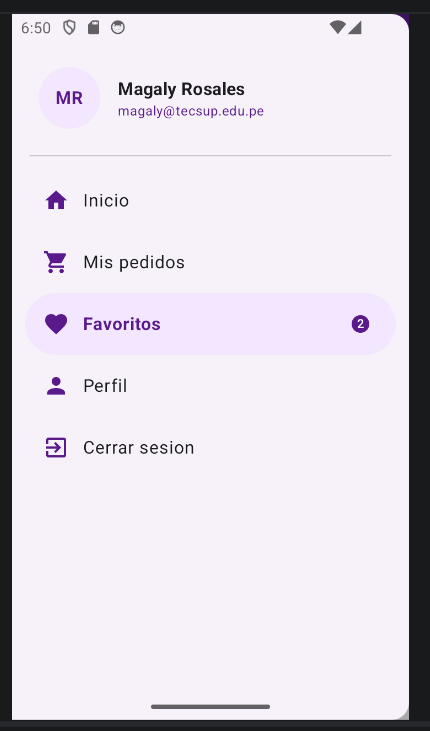
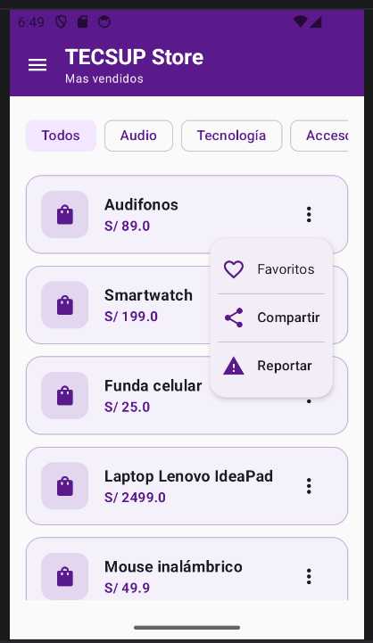
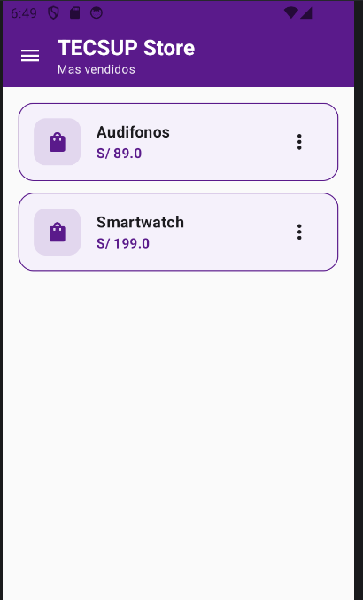
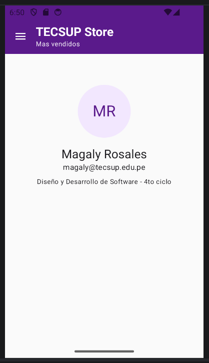

# TECSUP Store -  Fase 2 (Mejora con IA)

## Capturas

## Prompt utilizado
Estás integrado en Android Studio y tienes acceso a mi proyecto TecsupStore (Kotlin, Jetpack Compose, Material 3, package com.rosales.tecsupstore). Modifica directamente los archivos del proyecto, no me des solo código suelto.

Archivos relevantes: AppNavegacion.kt, AppDrawer.kt, PantallaInicio.kt, TarjetaProducto.kt, DatosEjemplo.kt y Producto.

Ya tengo:
- Una lista de productos donde cada tarjeta tiene un ícono de 3 puntos que abre un DropdownMenu con la opción "Favoritos".
- Un ModalNavigationDrawer con los ítems Inicio, Mis pedidos, Favoritos y Perfil.

Mejora a implementar (adjunto imagen del enunciado de cómo debe quedar):
Agrega un badge con contador en el ítem "Favoritos" del drawer, que muestre cuántos productos marcó el usuario como favorito desde el DropdownMenu de cada producto. Una acción en el DropdownMenu debe reflejarse visualmente en el Drawer.
Requisitos funcionales:
1. Usa un mutableStateListOf<Int> con los ids de los productos favoritos, elevado (state hoisting) al composable padre en AppNavegacion.kt, y pásalo hacia abajo a PantallaInicio, TarjetaProducto y AppDrawer. Si ya existe en el proyecto, reutilízalo y no lo dupliques.
2. En el DropdownMenu de cada tarjeta, al pulsar "Favoritos": si el id del producto no está en la lista se agrega, si ya está se quita, y luego se cierra el menú.
3. En el NavigationDrawerItem de "Favoritos" usa el parámetro badge con un Badge que muestre favoritos.size, visible solo cuando favoritos.size sea mayor que 0.
Requisitos de estilo (seguir la imagen adjunta):
4. Usa una paleta morada (primary morado oscuro, containers lilas claros) para que la app se parezca a la imagen.
5. Barra superior morada con el título "TECSUP Store" y el subtítulo "Mas vendidos" en blanco.
6. Tarjetas de producto con fondo lila claro, bordes redondeados, un cuadro con ícono de bolsa a la izquierda, nombre en negrita y precio en morado.
7. DropdownMenu con bordes redondeados, íconos a la izquierda de cada opción (Favoritos, Compartir, Reportar) y divisores entre las opciones.
8. Drawer con encabezado de avatar circular con iniciales, nombre y correo, un divisor, ítem activo resaltado en lila con texto morado en negrita, y el badge del contador en morado a la derecha del ítem "Favoritos".

Restricciones: código simple, sin ViewModel, sin Hilt ni librerías extra. La funcionalidad existente (navegación, DropdownMenu, drawer) debe seguir funcionando igual; solo cambia lo necesario para el badge y los estilos. Al terminar, dime qué archivos modificaste.

